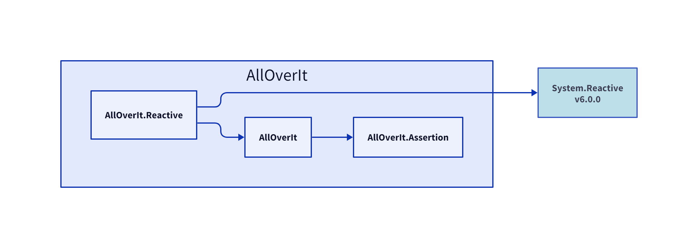

# AllOverIt.Reactive
---
**AllOverIt.Reactive**

# Dependencies
In the following diagram, explicit dependencies of **AllOverIt.Reactive** are shown in blue, and implicit dependencies (if any) are shown in yellow.

