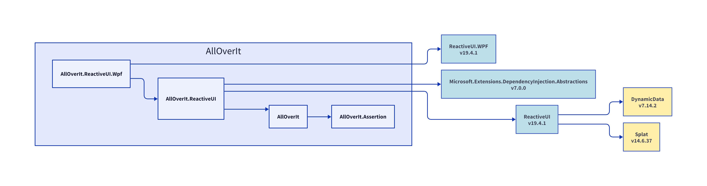

# AllOverIt.ReactiveUI.Wpf
---
**AllOverIt.ReactiveUI.Wpf**

# Dependencies
In the following diagram, explicit dependencies of **AllOverIt.ReactiveUI.Wpf** are shown in blue, and implicit dependencies (if any) are shown in yellow.

