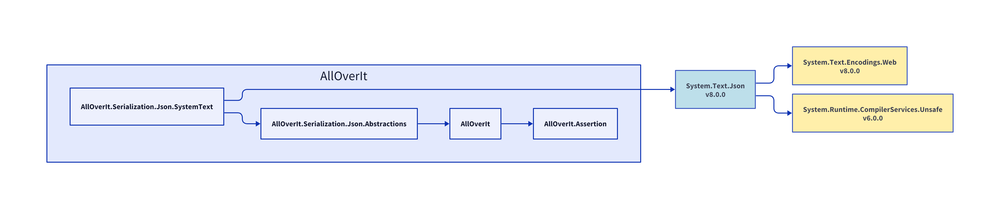

# AllOverIt.Serialization.Json.SystemText
---
**AllOverIt.Serialization.Json.SystemText**

# Dependencies
In the following diagram, explicit dependencies of **AllOverIt.Serialization.Json.SystemText** are shown in blue, and implicit dependencies (if any) are shown in yellow.

# [NET 6](#tab/net6)

# [NET 7](#tab/net7)

# [NET 8](#tab/net8)

---
