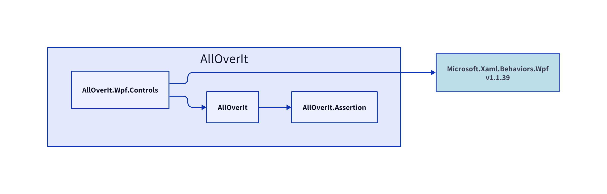

# AllOverIt.Wpf.Controls
---
**AllOverIt.Wpf.Controls**

# Dependencies
In the following diagram, explicit dependencies of **AllOverIt.Wpf.Controls** are shown in blue, and implicit dependencies (if any) are shown in yellow.

