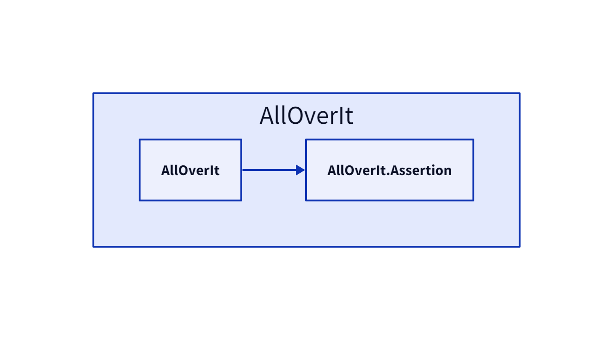

# AllOverIt - Overview
---
**AllOverIt** is a comprehensive library containing a diverse range of classes and utility functions, intended to tackle commonly encountered scenarios. Key areas catered for include threading, tasks, generic caching, event (message) aggregation, expression and reflection utilities, plugin contexts, enriched enums, pipelines, value objects, specifications, and dozens of extensions.

* [Aspects (Interceptors)](Aspects/interceptors.md) - Extends on .NET's [DispatchProxy](https://learn.microsoft.com/en-us/dotnet/api/system.reflection.dispatchproxy/) to provide a mechanism for intercepting method dispatches on proxy objects.

* [Async](Async/overview.md) - Includes a variety of asynchronous classes and utilities that assists working with tasks and their results.

* Caching -

* Collections -

* CommandLine -

* Converters -

* Diagnostics -

* Events -

* Expressions -

* Extensions -

* Formatters -

* Helpers -

* IO -

* Logging -

* [Patterns](Patterns/about.md) - Includes patterns...

* Plugin -

* Process -

* Reflection -

* Threading -

# Dependencies
In the following diagram, explicit dependencies of **AllOverIt** are shown in blue, and implicit dependencies (if any) are shown in yellow.

# [NET 6](#tab/net6)

# [NET 7](#tab/net7)

# [NET 8](#tab/net8)

---